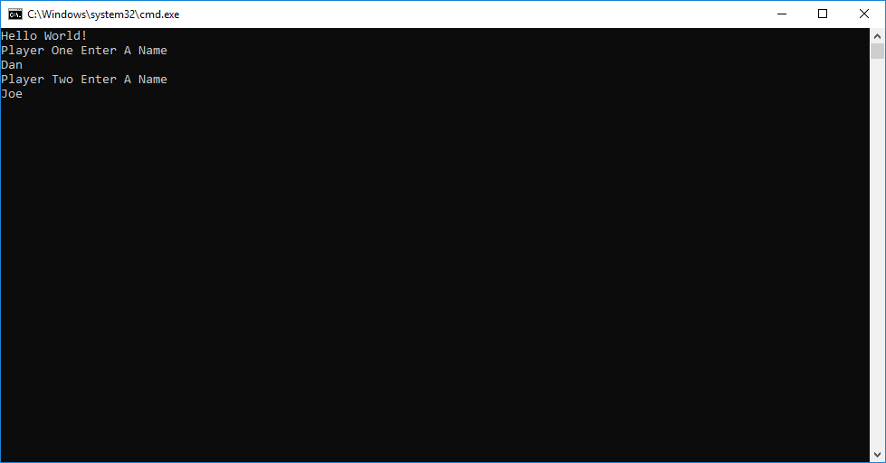
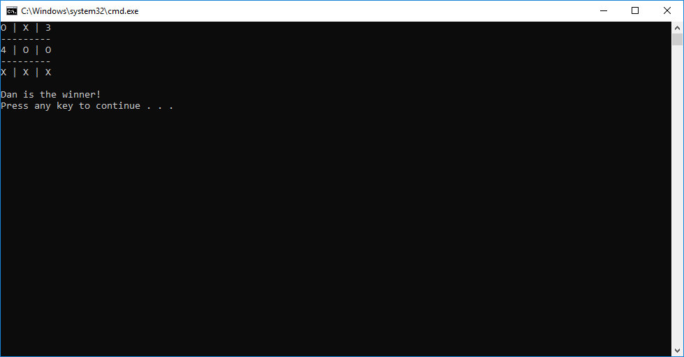

# Tic Tac Toe
#### Lab04_TicTacToe
##### *Author: Daniel Logerstedt*

------------------------------

## Description

This is an application built using C# that allows two players to enter their names and play Tic Tac Toe. The game will end once every position on the board is selected or a player gets 3 in a row.

------------------------------

## Getting Started
Clone this repository to your local machine.
```
$ git clone https://github.com/daniellogerstedt/Lab04-TicTacToe.git
```
#### To run the program from Visual Studio:
Select ```File``` -> ```Open``` -> ```Project/Solution```

Next navigate to the location you cloned the Repository.

Double click on the ```Lab04_TicTacToe``` directory.

Then select and open ```Lab04_TicTacToe.sln```

------------------------------

## Visuals

##### Application Start

##### Using the Application

##### Application End


------------------------------

## Change Log
1.0: Initial release, includes ability to play the game and see who the winner is afterward.
1.0.1: Fixed bug that caused already selected spaces to skip players turns.
1.0.2: Added summary comments to methods that were missing them.